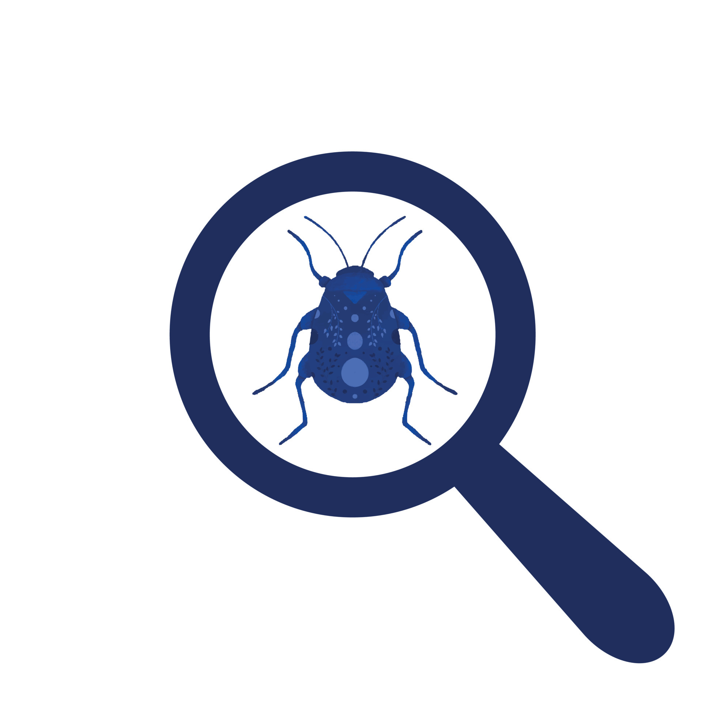

# List of all bugs found
## example bug
### screenshot

### description
this bug is about the alignment of the main nav bar. 
- works on desktop
- doesn't work on mobile app (ios)
### Bugs/design/solution
- **Bug**: In navigation: Subtopics don't expand
- **Sol**: ??
 
- **Bug**: Weird zoom-behavior with navigation opened (Nav width is fixed)
- **Sol**: ??
 
- **Bug**: In navigation: "Startseite" doesn't respond when clicking the bar it belongs to
- **Sol**: Make the bar responsive to touch, and not only the text "Startseite"

- **Rework whole navigation!**
 
- **Bug**: In "Kontakt", "Teilnehmer gesucht" and possibly more locations, the textfields aren't adopted to mobile and have a fixed width
- **Sol**: Fix textfields
 
- **design**: In "Projekte": layout with image and text is ugly -> embed image or put in on top or bottom

 

